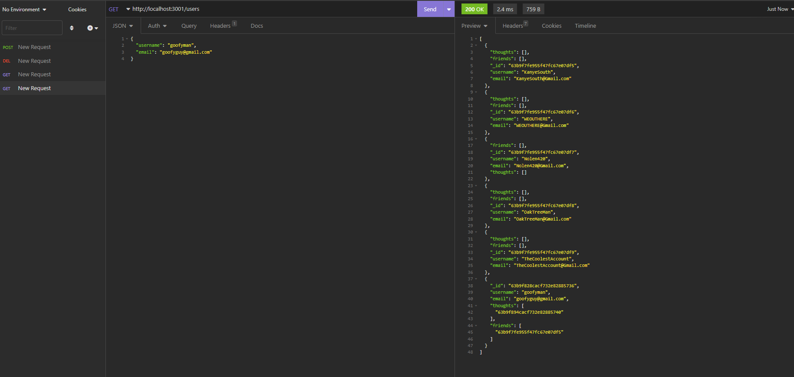

  # MSUBC_Module18_CH Social Netowkr API by Mateusz Zielinski
  ## Description
  This program contains a mongo database for a social network api containing users, their thoughts, and reactions to those thoughts
  
  
  ## License
  
  This application is not currently under any license agreement.
  ## Table of Contents
  - [License](#License)
  - [Usage](#Usage)
  - [Installation](#Installation)
  - [Testing](#Testing)
  - [Contributing](#Contributing)
  - [Tutorial](#Tutorial)
  ## Usage
  - open the project in vscode or another compatible editor
  - right click on 'server.js' and select 'open in integrated terminal'
  - in the command line type in 'npm i', then 'npm run seed', then 'npm start'
  - now you can use the setup routes to query the database
  ## Installation
  - open gitbash
  - navigate to the desired parent folder 
  - type into gitbash 'git clone https://github.com/IMadeThisJustToPostThis/MSUBC_Module18_CH-Social-Network-API.git'
  ## Testing
  no tests
  ## Contributing
  contibute however you want i don't care
  ## Questions
  Github:<https://github.com/IMadeThisJustToPostThis>
  
  Email: zielinm2@mail.lcc.edu
  ## Tutorial
  click on the image below to view the tutorial video
  
  